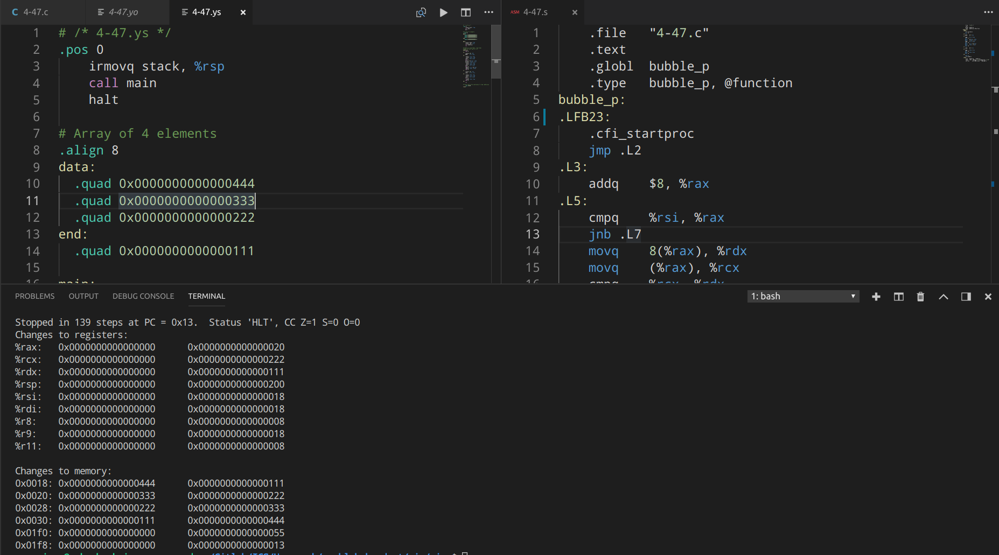
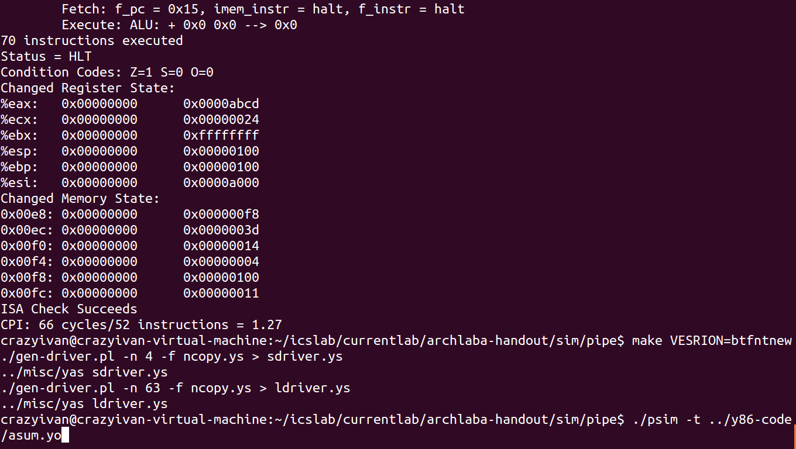

# Homework 05
CrazyIvanPro

[TOC]
## 4. 45

### A
+ bubble_p.c
```c
void bubble_p(long *data, long *end)
{
    long *i, *last;
    for (last = end; last > data; last--)
    {
        for (i = data; i < last; i++)
        {
            if (*(i + 1) < *i)
            {
                /* Swap adjacent elements */
                long t = *(i + 1);
                *(i + 1) = *i;
                *i = t;
            }
        }
    }
}
```


### B

+ Firstly, we could use gcc to generate assembly code (X86_64):
```bash
linux> gcc -Og -S bubble_p.c -o bubble_p.s
```

+ we get:
```assembly
	.file	"bubble_p.c"
	.text
	.globl	bubble_p
	.type	bubble_p, @function
bubble_p:
.LFB23:
	.cfi_startproc
	jmp	.L2
.L3:
	addq	$8, %rax
.L5:
	cmpq	%rsi, %rax
	jnb	.L7
	movq	8(%rax), %rdx
	movq	(%rax), %rcx
	cmpq	%rcx, %rdx
	jge	.L3
	movq	%rcx, 8(%rax)
	movq	%rdx, (%rax)
	jmp	.L3
.L7:
	subq	$8, %rsi
.L2:
	cmpq	%rdi, %rsi
	jbe	.L8
	movq	%rdi, %rax
	jmp	.L5
.L8:
	rep ret
	.cfi_endproc
.LFE23:
	.size	bubble_p, .-bubble_p
	.ident	"GCC: (Ubuntu 7.3.0-16ubuntu3) 7.3.0"
	.section	.note.GNU-stack,"",@progbits
```

+ Then translate it into Y86_64 version and add other code:
```assembly
# /* 4-47.ys */
.pos 0
    irmovq stack, %rsp
    call main
    halt

# Array of 4 elements
.align 8
data:
  .quad 0x0000000000000444
  .quad 0x0000000000000333
  .quad 0x0000000000000222
end:
  .quad 0x0000000000000111

main:
	irmovq	data, %rdi
    irmovq	end, %rsi
    call bubble_p
	ret

# bubble_p (long *data, long *end)
# data in %rdi, end in %rsi
bubble_p:
	jmp	L2
L3:
	irmovq	$8, %r8
	addq	%r8, %rax
L5:
	rrmovq	%rsi, %r9
  	rrmovq	%rax, %r10
  	subq 	%r9, %r10
	jge	L7
	mrmovq	8(%rax), %rdx
	mrmovq	(%rax), %rcx
	rrmovq	%rcx, %r9
  	rrmovq	%rdx, %r10
  	subq 	%r9, %r10
	jge	L3
	rmmovq	%rcx, 8(%rax)
	rmmovq	%rdx, (%rax)
	jmp	L3
L7:
	irmovq	$8,	%r11
	subq	%r11, %rsi
L2:
	rrmovq	%rdi, %r9
  	rrmovq	%rsi, %r10
  	subq 	%r9, %r10
	jle	L8
	rrmovq	%rdi, %rax
	jmp	L5
L8:
	ret

# Stack starts here and grows to lower addresses
	.pos 0x200
stack:
```

+ using yas and yis we can get output:

  

  

+ We can figure out that it does work.
  + At address 0x018, 0x020, 0x028, 0x030:
    + 0x444, 0x333, 0x222, 0x111 $\Rightarrow$ 0x111, 0x222, 0x333, 0x444


## 4.55

+ Download the Y86_64 version archlab-handout, edit pipe-btfnt as below (powered by git diff):

```diff
--- pipe-btfnt.hcl	2014-12-29 23:08:40.000000000 +0800
+++ pipe-btfntnew.hcl	2018-11-04 22:02:40.412000000 +0800
@@ -138,8 +138,10 @@
 
 ## What address should instruction be fetched at
 word f_pc = [
-	# Mispredicted branch.  Fetch at incremented PC
-	M_icode == IJXX && !M_Cnd : M_valA;
+	# Mispredicted case_1: Backward taken
+	M_icode == IJXX && M_ifun != UNCOND && M_valE < M_valA && !M_Cnd : M_valA;
+	# Mispredicted case_2: Forward not-taken
+	M_icode == IJXX && M_ifun != UNCOND && M_valE >= M_valA && M_Cnd : M_valE;
 	# Completion of RET instruction
 	W_icode == IRET : W_valM;
 	# Default: Use predicted value of PC
@@ -183,6 +185,8 @@
 # Predict next value of PC
 word f_predPC = [
 	# BBTFNT: This is where you'll change the branch prediction rule
+	f_icode == IJXX && f_ifun != UNCOND && f_valC < f_valP : f_valC;
+	f_icode == IJXX && f_ifun != UNCOND && f_valC >= f_valP : f_valP;
 	f_icode in { IJXX, ICALL } : f_valC;
 	1 : f_valP;
 ];
@@ -244,12 +248,15 @@
 # way to get valC into pipeline register M, so that
 # you can correct for a mispredicted branch.
 
+# Pass valC by M_valE, Pass valP by M_valA
+
 ## Select input A to ALU
 word aluA = [
 	E_icode in { IRRMOVQ, IOPQ } : E_valA;
 	E_icode in { IIRMOVQ, IRMMOVQ, IMRMOVQ } : E_valC;
 	E_icode in { ICALL, IPUSHQ } : -8;
 	E_icode in { IRET, IPOPQ } : 8;
+	E_icode in { IJXX } : E_valC;
 	# Other instructions don't need ALU
 ];
 
@@ -258,6 +265,7 @@
 	E_icode in { IRMMOVQ, IMRMOVQ, IOPQ, ICALL, 
 		     IPUSHQ, IRET, IPOPQ } : E_valB;
 	E_icode in { IRRMOVQ, IIRMOVQ } : 0;
+	E_icode in { IJXX } : 0;
 	# Other instructions don't need ALU
 ];
 
@@ -343,7 +351,11 @@
 
 bool D_bubble =
 	# Mispredicted branch
-	(E_icode == IJXX && !e_Cnd) ||
+	# Mispredicted as case_1 and case_2: Backward or Forward
+	(
+	(E_icode == IJXX && E_ifun != UNCOND && E_valC < E_valA && !e_Cnd) ||
+	(E_icode == IJXX && E_ifun != UNCOND && E_valC >= E_valA && e_Cnd)
+	) ||
 	# BBTFNT: This condition will change
 	# Stalling at fetch while ret passes through pipeline
 	# but not condition for a load/use hazard
```


+ Notice that expression below means jxx except jmp. While J_YES haven't been found in this file, UNCOND was used instead.
```c
M_icode == IJXX && M_ifun != UNCOND
```


+ Using files in folder pipe to test it, We find that: **ISA Check Succeeds**.

  


+ Test Succeeded.