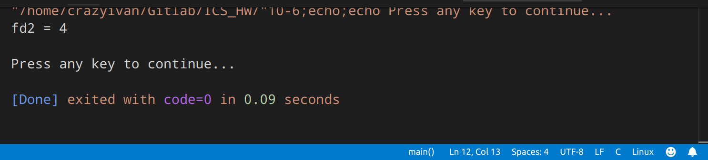
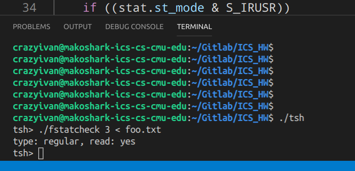

# Homework 08
CrazyIvanPro

[TOC]
## 10. 6
+ Notice that the descriptor return is always the smallest descriptor that is not currently open in the process, the answer is:
```c
fd2 = 4
```



## 10. 9

+ fstatcheck.c:

  ```c++
  #include "csapp.h"
  
  int main(int argc, char **argv)
  {
      struct stat stat;
      char *type, *readok;
  
      int fd;
      if (argc <= 1)
          fd = 0;
      else
          fd = atoi(argv[1]);
  
      fstat(fd, &stat);
  
      if (S_ISREG(stat.st_mode))
          type = "regular";
      else if (S_ISDIR(stat.st_mode))
          type = "dir";
      else
          type = "other";
      if ((stat.st_mode & S_IRUSR))
          readok = "yes";
      else
          readok = "no";
  
      printf("type: %s, read: %s\n", type, readok);
  
      return 0;
  }
  ```

  

+ Answer (Based on modified tsh):

```c
if (Fork() == 0) {	/* child */
  Dup2(0, 3);
  Execve("fstatcheck", argv, envp);
}
```


+ OUTPUT:

```c
tsh> ./fstatcheck
type: regular, read: yes
```

